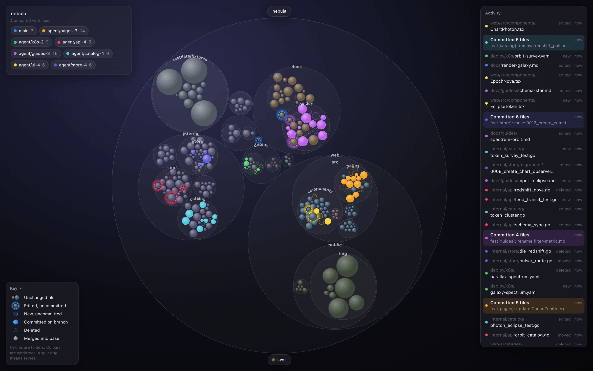

# Orion

A live, beautiful map of your git repository. Watch files appear, change, move and get committed in real time, across every worktree, as you and your coding agents work.



Orion draws the repo as nested bubbles: folders are circles, files are bubbles sized by bytes. Each worktree gets a colour, and whatever it touches glows in that colour. Uncommitted work shows as a faint ghost until it is committed, stays tinted while it lives only on its branch, and shimmers back to normal once it is merged.

## Install

macOS and Linux, with `git` 2.30 or newer:

```sh
brew install olliejudge/tap/orion
```

You can also download a tarball for your platform from the [releases page](https://github.com/olliejudge/orion/releases), unpack it and put `orion` on your `PATH`. The binary isn't notarized, so on macOS clear the download quarantine first: `xattr -d com.apple.quarantine ./orion`.

## Usage

```sh
cd your-repo
orion
```

Orion prints a URL like `http://127.0.0.1:7070/?t=…`, opens it in your browser and keeps the map live until you press Ctrl-C.

```
orion [path] [--port N] [--no-open] [--base BRANCH] [--dev] [--version]
```

| Flag | Meaning |
|---|---|
| `path` | Any directory inside the repo, including inside a linked worktree. Default: the current directory. |
| `--port N` | Port to listen on. Default 7070; if it is taken, the next free port is used. |
| `--no-open` | Print the URL but don't open a browser. |
| `--base BRANCH` | Branch to compare against. Default: `origin`'s default branch, then `main`, then `master`, then the main worktree's current branch. |
| `--dev` | Serve no embedded UI; expect Vite's dev server at `:5173` instead. A busy port is an error rather than falling back, because Vite proxies to that exact port. For contributors, see "Building from source" below. |
| `--version` | Print the version and exit. |

`orion -h` prints the usage.

In the browser:

- Click a folder to zoom in. Press Esc or click the background to zoom out.
- Click a worktree in the legend to isolate it. Click it again, or press Esc, to show everything.
- Hover a row in the activity stream to find that file on the map. Click the row to zoom to it.
- Press `N` to switch between the Vision and Night themes. Press `F` for full screen.

## What you're looking at

Every change is shown relative to the **base branch**, and goes through three stages:

| On the map | Meaning |
|---|---|
| Ghost bubble: faint fill in the worktree's colour, dashed outline | A new file that isn't committed yet |
| Normal bubble with a glowing halo and a dashed ring | An existing file with uncommitted edits |
| Solid bubble tinted in the worktree's colour, thin solid ring | Committed on that worktree's branch, but not yet in the base branch |
| Bubble shrunk to a faint outline | Deleted (it stays until the deletion reaches the base branch) |
| Bubble gliding to a new place | Renamed or moved |
| Ring split into coloured arcs | Touched by more than one worktree |
| A brief shimmer, then back to its file-type colour | Merged into the base branch |

The main worktree is always blue ("you"). Other worktrees get colours in the order they first become active. With the default base (`origin`'s default branch), unpushed commits on `main` count as "on a branch" until they are pushed, because they haven't landed yet.

The legend (top left) lists active worktrees with a count of changed files. The activity stream (right) lists the latest changes, commits and merges, newest first. Hover any bubble for its full path, size, and which worktrees are touching it.

There are two themes, and Orion remembers your choice:

- **Vision** (the default): frosted-glass panels, and files shaded in colours by file type.
- **Night**: a black background with idle files in graphite, so only worktree activity is in colour. The legend fades until you point at it, and the activity stream moves to the bottom right, its rows fading with age.

## Privacy and security

- Orion runs entirely on your machine. It makes no network requests of its own and has no telemetry.
- The server binds to `127.0.0.1` only. Each run generates a random token, which is part of the URL Orion prints; the browser swaps it for a cookie (`orion_t_<port>`) on first load. Requests without the token are refused, and so are requests with a foreign `Host` or `Origin`, so other websites can't read your repo through it.
- It reads git metadata and file sizes. It never reads file contents.

## Try it on a demo repo

`scripts/demo` builds a synthetic repository (an invented project called "nebula") with several agent worktrees, then simulates agents and a human editing, moving, committing and merging:

```sh
go run ./scripts/demo            # prints the repo path, then keeps simulating until Ctrl-C
orion <the path it printed>      # in another terminal
```

Options: `--dir DIR`, `--agents N` (1–8), `--seed N`, `--speed X`, and `--once` (with `--steps N`, default 40) to set up, run a fixed number of steps and exit. The demo only ever deletes a directory it created itself.

## Building from source

You need Go 1.27, Node 22.12 or newer (CI uses Node 24), pnpm and git.

```sh
make build   # builds the web UI into internal/webassets/static, then bin/orion
make test    # Go and web unit tests
make lint    # go vet, golangci-lint and the web linters
make dev     # Vite dev server with hot reload, proxied to `orion --dev`
```

`make dev` maps this checkout; use `REPO=/path/to/repo make dev` for another repo, and open the `dev UI (Vite)` URL it prints.

`go build ./...` also works without Node: the binary then serves a page asking you to run `make web`.

## Releasing

Push a `vX.Y.Z` tag. The release workflow runs GoReleaser on macOS, publishes the GitHub release, and updates the cask in [olliejudge/homebrew-tap](https://github.com/olliejudge/homebrew-tap).

This needs a one-time setup: the public `olliejudge/homebrew-tap` repo, and a fine-grained token with Contents read/write access to it, stored as the `HOMEBREW_TAP_GITHUB_TOKEN` secret on this repo. Without it, the workflow stops before publishing a stable tag; prerelease tags such as `v1.2.3-rc.1` don't update the tap. To try a release locally without publishing anything, run `goreleaser release --snapshot --clean`; the output lands in `dist/`.

## License

[MIT](LICENSE)
