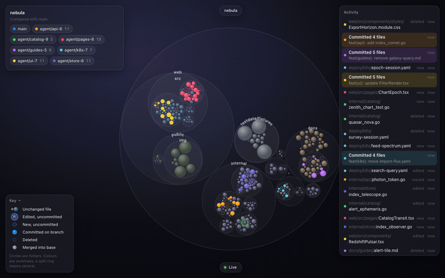
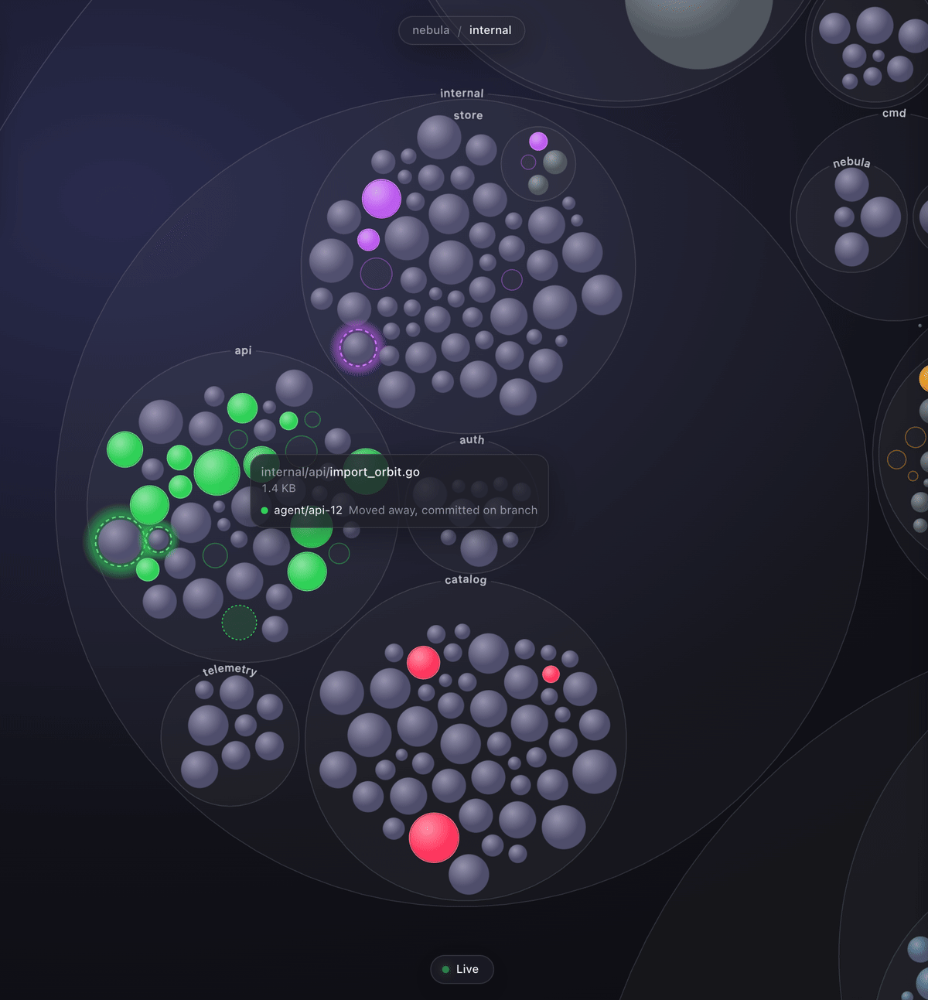

# Orion

A live, beautiful map of your git repository. Watch files appear, change, move and get committed in real time, across every worktree, as you and your coding agents work.


Orion draws the repo as nested bubbles: folders are circles, files are bubbles sized by bytes. Each worktree gets a colour, and whatever it touches fills with that colour; a small mark says what happened to it, and brightness says how recently. New files get a +, deleted ones a ×, committed work a ring while it lives only on its branch, and everything shimmers back to grey once it is merged. It's a single binary that serves the map to your browser; nothing leaves your machine.



## Reading the map

The page has its own collapsible key in the bottom-left corner. It shows these marks, drawn the way the map draws them, and remembers whether you left it open. Here is the same thing in words:

- **Circles are folders**, nested as they are on disk, with the folder's name set along the top of its circle.
- **Bubbles are files.** A bubble's area grows with the file's size in bytes.
- **Colour is the worktree.** Unchanged files are quiet grey discs. Whatever a worktree touches is filled with that worktree's colour.
- **Brightness is recency.** Bubbles are brightest when just touched and fade over an hour, a day and a week, to faint after a few months. Unchanged files fade by their last commit, so busy parts of the repo stand out from cold ones; changed files always stay brighter than unchanged ones. Hover a file for the exact time.

Every change is shown relative to the **base branch**, and goes through three stages:

| On the map | Meaning |
|---|---|
| Filled in the worktree's colour, with a soft glow | An existing file with uncommitted edits |
| Filled in the worktree's colour with a **+** | A new file that isn't committed yet |
| Filled in the worktree's colour, thin solid ring | Committed on that worktree's branch, but not yet in the base branch |
| Hollow, smaller, with a **×** | Deleted (it stays until the deletion reaches the base branch) |
| Bubble gliding to a new place | Renamed or moved |
| Ring split into coloured arcs | Touched by more than one worktree |
| A brief shimmer, then back to grey | Merged into the base branch |

The main worktree is always blue ("you"). Other worktrees get colours in the order they first become active. With the default base (`origin`'s default branch), unpushed commits on `main` count as "on a branch" until they are pushed, because they haven't landed yet.

Around the map:

- **Legend** (top left): the repo, the branch it is compared with, and a pill for each active worktree with its count of changed files. Idle worktrees fold into "+N idle".
- **Activity stream** (right): the latest changes, commits ("Committed 4 files") and merges ("Merged 12 files into main"), newest first.
- **Key** (bottom left): what each kind of mark means. Click "Key" to fold it away or open it again.
- **Tooltip**: hover any bubble for its full path, its size, and which worktrees are touching it and at what stage.
- **Status pill** (bottom): "Live" while connected. If Orion stops, the pill says so, and the page picks up again when Orion restarts.

With `prefers-reduced-motion` set, bubbles and the camera jump instead of animating, and a merge gets a brief static highlight instead of the shimmer.

## Install

macOS and Linux, with `git` 2.30 or newer:

```sh
brew install olliejudge/tap/orion
```

You can also download a tarball for your platform from the [releases page](https://github.com/olliejudge/orion/releases), unpack it and put `orion` on your `PATH`. Releases from v0.1.0 on are signed and notarized, so macOS runs them without a Gatekeeper prompt. If you build from source or grab a snapshot build (e.g. from a fork), clear the download quarantine first: `xattr -d com.apple.quarantine ./orion`.

To build it yourself, see [Building from source](#building-from-source).

## Usage

```sh
cd your-repo
orion
```

Orion prints a URL like `http://127.0.0.1:7070/?t=…`, opens it in your browser and keeps the map live until you press Ctrl-C. The URL stays the same from run to run, so you can bookmark it (or, once it has loaded, just `http://127.0.0.1:7070/`, as long as Orion gets the same port). An open tab reconnects by itself when Orion restarts, and reloads if Orion was upgraded.

```
orion [path] [--port N] [--no-open] [--base BRANCH] [--dev] [--version]
```

| Flag | Meaning |
|---|---|
| `path` | Any directory inside the repo, including inside a linked worktree. Default: the current directory. |
| `--port N` | Port to listen on. Default 7070; if it is taken, the next free port is used. |
| `--no-open` | Print the URL but don't open a browser. |
| `--base BRANCH` | Branch to compare against. Default: `origin`'s default branch, then `main`, then `master`, then the main worktree's current branch. |
| `--dev` | Serve no embedded UI; expect Vite's dev server at `:5173` instead. A busy port is an error rather than falling back, because Vite proxies to that exact port. For contributors, see "Building from source" below. |
| `--version` | Print the version and exit. |

`orion -h` prints the usage.

## Getting around



- **Zoom** with the mouse wheel, two-finger scroll or a trackpad pinch; the map zooms around the pointer. **Drag** to pan.
- **Click** a folder to zoom in one level towards it, or **double-click** to go straight there. Clicking the folder you're in steps out one level, and clicking outside the repo goes back to the whole repo.
- **Breadcrumbs** at the top show where you are; click one to jump back to it.
- **Esc** or **Backspace** steps out one level (if a worktree is isolated, the first press clears that).
- Click a worktree in the **legend** to isolate it; the others dim. Click it again, or press Esc, to show everything.
- Hover a row in the **activity stream** to find that file on the map. Click the row to zoom to it.
- Press **N** to switch between the Vision and Night themes, and **F** for full screen.

## Themes

Orion has two themes and remembers your choice:

- **Vision** (the default, above): frosted-glass panels, and files shaded in colours by file type.
- **Night** (below): a black background with idle files in graphite, so only worktree activity is in colour. The legend fades until you point at it, the key stays dim until you do, and the activity stream moves to the bottom right, its rows fading with age.


## Privacy and security

- Orion runs entirely on your machine. It makes no network requests of its own and has no telemetry.
- The server binds to `127.0.0.1` only. The first run generates a random token and saves it, readable only by you, as `orion/token` in your user config directory (`~/Library/Application Support` on macOS, `~/.config` on Linux). The token is part of the URL Orion prints; the browser swaps it for a cookie (`orion_t_<port>`) on first load. Requests without the token are refused, and so are requests with a foreign `Host` or `Origin`, so other websites can't read your repo through it. The token is reused by every Orion you run, so treat the URL like a password: anyone who has it can read your repos' file names while Orion is running. Delete the file to rotate the token (Orion also replaces it if its permissions let others read it); if Orion can't read or write it, it uses a one-off token for that run.
- It reads git metadata and file sizes. It never reads file contents.

## Try it on a demo repo

`scripts/demo` builds a synthetic repository (an invented project called "nebula") with several agent worktrees, then simulates agents and a human editing, moving, committing and merging:

```sh
go run ./scripts/demo            # prints the repo path, then keeps simulating until Ctrl-C
orion <the path it printed>      # in another terminal
```

Options: `--dir DIR`, `--agents N` (1–8), `--seed N`, `--speed X`, and `--once` (with `--steps N`, default 40) to set up, run a fixed number of steps and exit. The demo only ever deletes a directory it created itself.

The images in this README come from `go run ./scripts/demo --agents 7 --seed 7 --speed 3`, a minute or two in.

## Building from source

You need Go 1.27, Node 22.12 or newer (CI uses Node 24), pnpm and git.

```sh
make build   # builds the web UI into internal/webassets/static, then bin/orion
make test    # Go and web unit tests
make lint    # go vet, golangci-lint and the web linters
make dev     # Vite dev server with hot reload, proxied to `orion --dev`
```

`make dev` maps this checkout; use `REPO=/path/to/repo make dev` for another repo, and open the `dev UI (Vite)` URL it prints.

`go build ./...` also works without Node: the binary then serves a page asking you to run `make web`.

## Releasing

Push a `vX.Y.Z` tag. The release workflow runs GoReleaser on macOS, publishes the GitHub release, and updates the cask in [olliejudge/homebrew-tap](https://github.com/olliejudge/homebrew-tap). It needs a one-time setup: the `HOMEBREW_TAP_GITHUB_TOKEN` secret, plus the optional Apple secrets that sign and notarize the macOS binaries. [docs/RELEASING.md](docs/RELEASING.md) covers the setup and how to check a release. To try a release locally without publishing anything, run `goreleaser release --snapshot --clean`; the output lands in `dist/`.

## License

[MIT](LICENSE)
